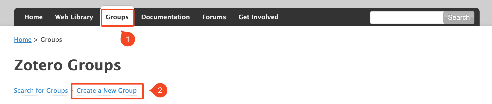
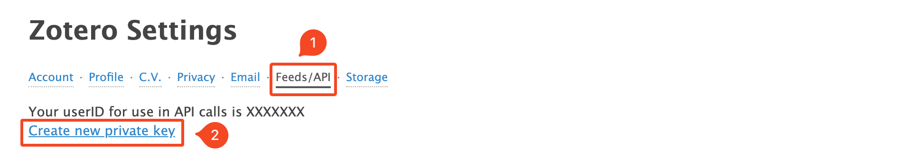
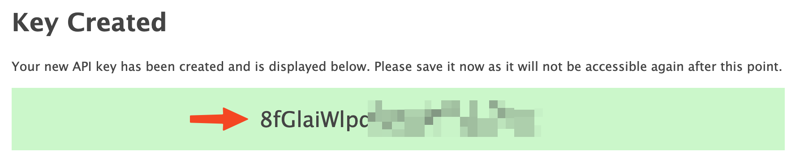

# How to find your Zotero API key and library ID
Disclaimer: This is a quick guide to get the Zotero API key and the library ID. We assume you already have a Zotero account and a library. If not, you can create one [here](https://www.zotero.org/user/register/). Please note that using *Knowledge Mapping* with a few number of papers may lead to irrelevant results.
## Get the library ID
1. Go to the [Zotero website](https://www.zotero.org/) and sign in
2. Click on your profile in the top right corner and `My Profile` link.

   

3. Make sure that the papers you want to share are in a group. If not, you can create one by clicking on `New Group` and then `Create a new group`. Just fill the settings that fit your needs.
   
   

4. You can now click on the group you want to share and copy the `Library ID` (it's the number in the URL)

    
## Get the API key

5. Click on the `Feeds/API` tab and `Create a new private key`

   

   Then

   

## Create a new private key
   
1. Fill the Key Description and a
2. Tick `Per Group Permissions` (1), Add `Read only` access (2) to the key.

   
   
3. Finish by clicking on `Save Key`
4. Copy and save the key in a safe place

   
